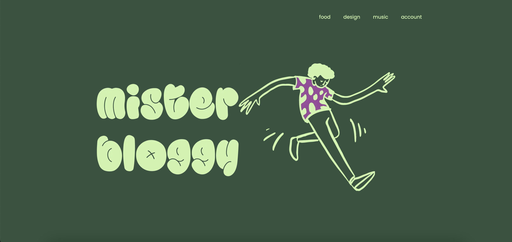
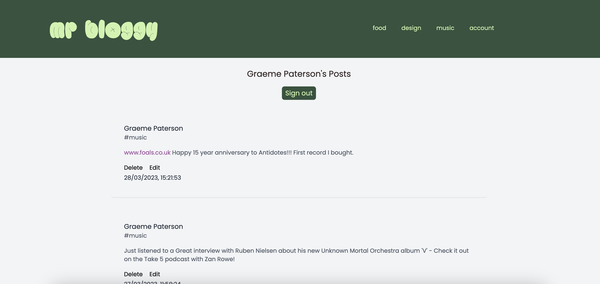
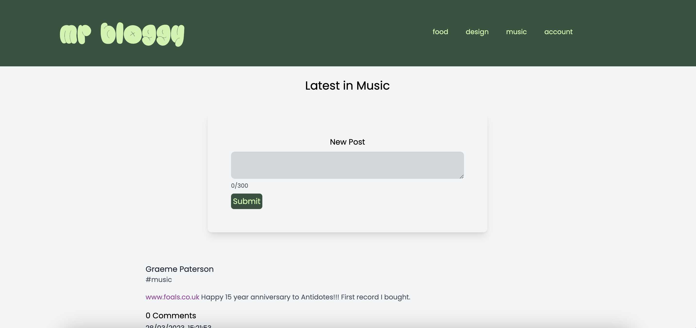

## About Mister Bloggy

I built this blog web application to be able to share the latest in music, food and design with my friends. Users can log in with Google Authetication and make posts or comment on posts by friends. On their account page, users can see all their posts and edit or delete their own posts.

## Frameworks

- Next.js
- Firebase
- Tailwindcss
- Figma

## What I learned

- My first introduction to Firebase database.
- Using Google Authentication.
- Using Figma to develop a clear and consistent design.

## Installation

```js
$ git clone https://github.com/ghpaterson/bloggy.git
$ cd bloggy
$ npm install
```

## Viewing Mister Bloggy

First, run the development server from the main project-directory:

```js
$ cd bloggy
$ npm run dev
```

Open [http://localhost:3000](http://localhost:3000) to see Mister Bloggy in your browser.

visit https://bloggy-inky.vercel.app/

## Screen

Home



Posts



Account



## Deploy on Vercel

The easiest way to deploy your Next.js app is to use the [Vercel Platform](https://vercel.com/new?utm_medium=default-template&filter=next.js&utm_source=create-next-app&utm_campaign=create-next-app-readme) from the creators of Next.js.

Check out our [Next.js deployment documentation](https://nextjs.org/docs/deployment) for more details.
